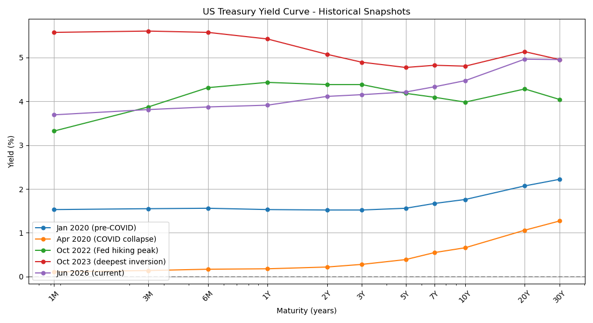
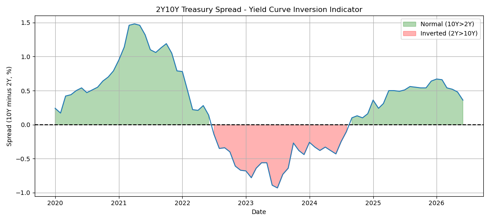
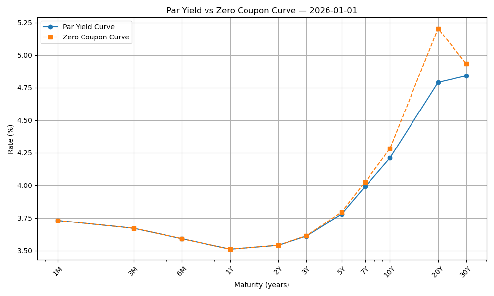
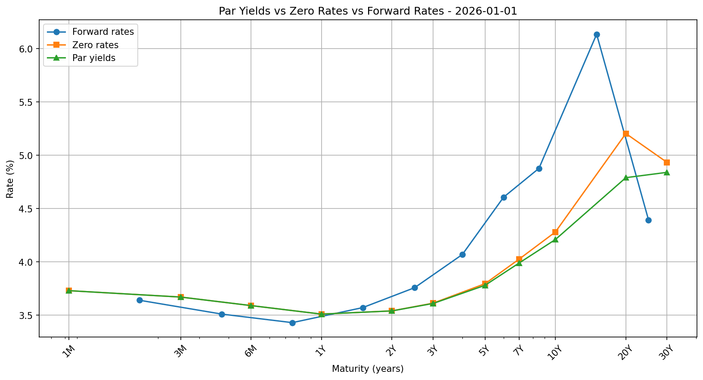
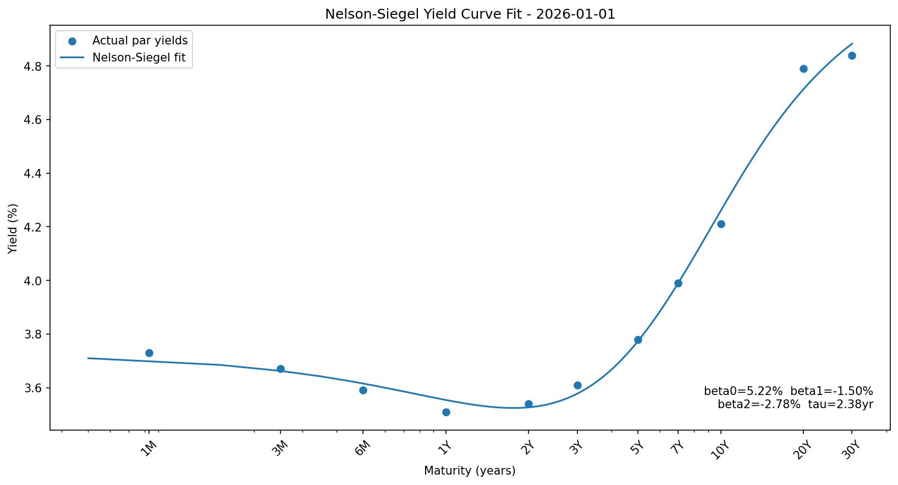

# US Treasury Yield Curve Analysis

A quantitative analysis of the US Treasury yield curve using real FRED data — 
bootstrapping zero-coupon rates, extracting forward rates, and fitting the 
Nelson-Siegel model. Built in Python.

## What this project covers

Starting from raw par yields pulled directly from the Federal Reserve (FRED), 
this project builds the full fixed income analytics pipeline:
1. **Historical curve visualization** — snapshots at five key macro dates showing 
   the COVID collapse, Fed hiking cycle, deepest inversion, and normalization
2. **2Y10Y spread analysis** — the classic recession indicator tracked over time, 
   with the inversion period clearly marked
3. **Zero-coupon curve bootstrapping** — extracting spot rates from par yields by 
   iteratively solving for each zero rate using previously derived zeros
4. **Forward curve extraction** — implied future rates derived from the zero curve, 
   showing what the market was pricing in at each horizon
5. **Nelson-Siegel fitting** — parametric curve fitting that reduces the entire 
   yield curve to four interpretable parameters: level (beta0), slope (beta1), 
   curvature (beta2), and decay (tau)

## Key results (January 2026)

| Metric | Value |
|---|---|
| 2Y10Y spread | +0.36% (normalized after inversion) |
| Deepest inversion | −0.93% (July 2023) |
| NS long-run level (beta0) | 5.22% |
| NS slope (beta1) | −1.50% (upward sloping) |
| NS curvature (beta2) | −2.78% |
| NS decay (tau) | 2.38 years |

## Charts

### Historical yield curve snapshots

### 2Y10Y spread — inversion indicator

### Par yields vs zero-coupon curve

### Par yields, zero rates, and forward rates

### Nelson-Siegel fit

## Key concepts demonstrated

**Par yield vs zero rate:** Par yields blend cash flows at multiple maturities 
into one number. Zero rates isolate each maturity. On an upward-sloping curve, 
zero rates always exceed par yields because intermediate coupons are discounted 
at lower short-term rates — bootstrapping unmixes them.

**Forward rates:** The implied rate for a future period between two maturities. 
The January 2026 forward curve showed near-term rate cuts priced in (short 
forwards declining), followed by normalization to 4-5% in the medium term, 
with elevated long-dated forwards reflecting term premium and fiscal uncertainty.

**Nelson-Siegel:** A three-factor model that describes any yield 
curve shape with four parameters. The level (beta0) anchors the long run, the 
slope (beta1) captures the short-to-long spread, and the curvature (beta2) describes 
the hump. Comparing parameters across time tracks how the curve is evolving — 
one number per factor, any point in time.

**The 2Y10Y inversion (2022-2024):** The deepest inversion in 40 years at 
−0.93%. The Fed raised short-term rates to fight inflation faster than long-term 
rates adjusted, because long rates reflect expected future short rates — not 
current ones. The curve normalized by late 2024 as the market priced in cuts.

## Data source

All data from FRED (Federal Reserve Economic Data), St. Louis Fed — free, 
publicly available, identical in quality to Bloomberg for daily Treasury yields. 
Tickers: GS1M, GS3M, GS6M, GS1, GS2, GS3, GS5, GS7, GS10, GS20, GS30.

## Tech
Python, NumPy, pandas, matplotlib, scipy, pandas-datareader

Built by Naumenko Analytics LLC
